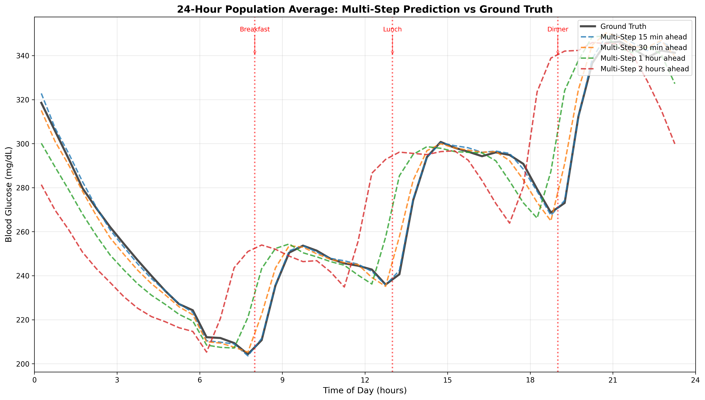
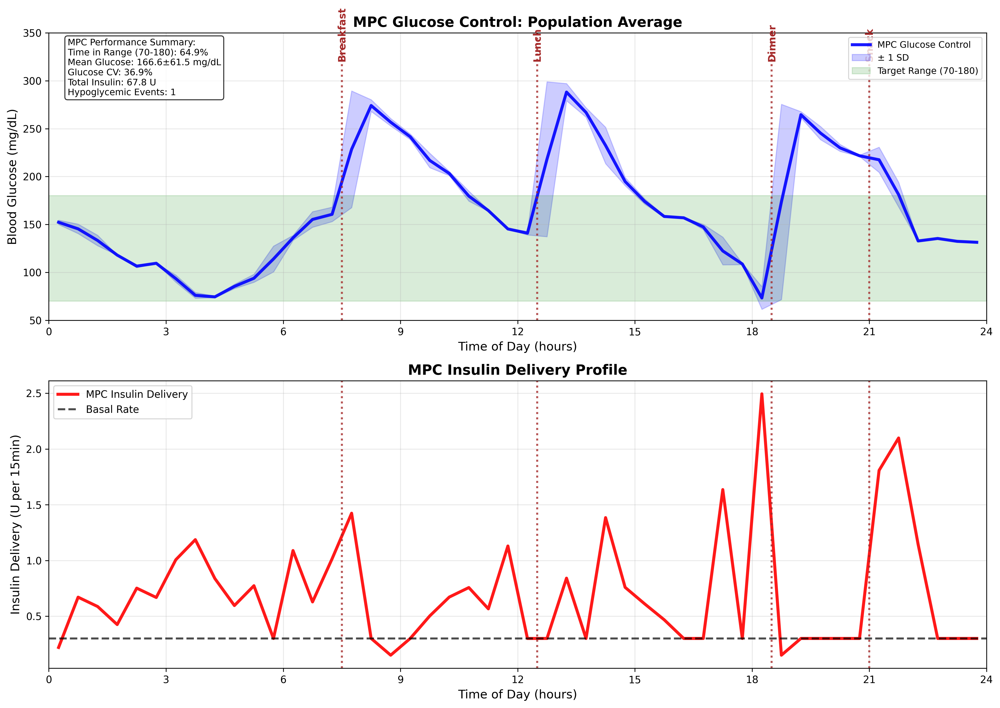

# LSTM-MPC Blood Glucose Control System

## Overview

This repository implements a complete **LSTM-based Model Predictive Control (MPC)** system for automated blood glucose control in diabetes management, based on the methodology described in **Aiello et al. 2023**.

The system combines:
- **SimGlucose Simulator**: To generate training and validation data for different scenarios
- **FT Predictor**: Long Short-Term Memory (LSTM)-based 8-step glucose predictions
- **GT Predictor**: Insulin correction factor to capture the relation between glucose concentration and injected bolus insulin
- **MPC Controller**: Insulin delivery controller with physiological constraints

## Key Features

### **Advanced Prediction**
- **Dual predictor architecture** (FT + GT) for enhanced insulin-aware predictions
- **8-step prediction horizon** (120 minutes ahead at 15-minute intervals)
- **Temporal-aware training** with forward chaining validation

### **Performance Metrics**
- **Time in Range (70-180)**: ~64.9%
- **Glucose Variability (CV)**: ~36.9% 
- **Safety**: Minimal hypoglycemia events
- **Meal responsiveness**


### **Glucose Predictions**

*FT+GT glucose prediction accuracy across multiple prediction horizons*

### **MPC Glucose Control**

*24-hour MPC glucose control*

## System Architecture

```
┌─────────────────┐    ┌──────────────────┐    ┌─────────────────┐
│  SimGlucose     │ ──▶│   FT Predictor   │ ──▶│                 │
│  Data Generator │    │  (State → Gluc)  │    │   Combined      │
└─────────────────┘    └──────────────────┘    │   FT+GT         │ ──▶ MPC Controller
                                               │   Predictor     │
┌─────────────────┐    ┌──────────────────┐    │                 │
│  CGM Patterns   │ ──▶│   GT Predictor   │ ──▶│                 │
│  (History)      │    │  (CGM → Corr.)   │    └─────────────────┘
└─────────────────┘    └──────────────────┘
```

## File Structure

### **Core Scripts**
```
algorithm/
├── temporal_simglucose_generator.py  # Data generation with insulin scenarios
├── ft_trainer.py                     # FT predictor training
├── gt_trainer.py                     # GT predictor training  
├── combined_predictor.py             # Combined FT+GT system
└── mpc.py                            # Complete MPC controller
```

## Quick Start

### **Prerequisites**
```bash
# Required packages
pip install torch numpy sklearn matplotlib scipy
pip install simglucose  # For glucose simulation
```

### **MPC Control Performance**
```
Time in Range (70-180 mg/dL):     64.9%
Time in Range (70-250 mg/dL):     81.4%
Mean Glucose:                     166.6 ± 61.5 mg/dL
Glucose CV:                       36.9%
Total Daily Insulin:              67.80 U
Hypoglycemic Events (<70):        1 (mild only)
```

## Algorithm Details

### **FT Predictor**
- **Input**: Complete state vector (75+ features)
  - CGM history (25 steps)
  - Insulin history (25 steps) 
  - Carb history (25 steps)
  - Time features
- **Architecture**: LSTM (2 layers, 128 hidden units)
- **Output**: 8-step glucose predictions (15min intervals)

### **GT Predictor**  
- **Input**: CGM history only (25 features)
- **Target**: Insulin correction factors (FT_S2 - FT_S1)
- **Architecture**: LSTM (2 layers, 64 hidden units)
- **Purpose**: Learn insulin effects indirectly from glucose patterns

### **MPC Cost Function**
```
J = (Ŷ - Y_target)ᵀQ(Ŷ - Y_target) + (U - U_basal)ᵀR(U - U_basal)

Where:
- Ŷ: Predicted glucose trajectory (8 steps)
- Y_target: Dynamic setpoint (110 mg/dL day, 125 mg/dL night)
- U: Insulin delivery trajectory (8 steps)  
- U_basal: Basal insulin rate (0.3 U per 15min)
- Q: Glucose tracking weight (1.0)
- R: Insulin deviation weight (25.0 × meal_penalty_factor)
```

### **Meal Penalty Factors**
```python
# Meal windows: ±1.5h around meals (7.5h, 12.5h, 18.5h, 21.0h)
if in_meal_window:
    penalty = 0.3   # Low penalty → more aggressive insulin
elif 4.0 <= hour <= 8.0:  # Dawn period
    penalty = 2.5   # High penalty → conservative insulin  
else:
    penalty = 2.0   # Standard penalty → moderate insulin
```

## Scientific Validation

### **Training Data**
- **SimGlucose simulator**: 7 adult patients × 14 days each
- **Scenario-I**: Basal insulin only (baseline glucose patterns)
- **Scenario-II**: Basal + bolus insulin (with meal responses)
- **Forward chaining**: Temporal validation preserving circadian patterns

### **Safety Features**
- **Glucose bounds**: 70-300 mg/dL (hard constraints)
- **Insulin bounds**: 0-3.0 U per 15min (10x basal maximum)
- **Optimization fallback**: Basal insulin if MPC optimization fails
- **Hypoglycemia prevention**: Conservative targets and penalties

## References

1. **Aiello, E. M., et al.** (2024). "Model Predictive Control (MPC) of an Artificial Pancreas with
Data-Driven Learning of Multi-Step-Ahead Blood Glucose Predictors." *Control Engineering Practice*. https://www.sciencedirect.com/science/article/abs/pii/S0967066123003799?via=ihub

2. **Xie, J.** (2018). "Simglucose v0.2.1" - A Type-1 Diabetes simulator implemented in Python for Reinforcement Learning purpose. https://github.com/jxx123/simglucose

## License

This implementation is for research and educational purposes. Clinical deployment requires regulatory approval and extensive safety validation.


**Medical Disclaimer**: This is a research implementation. Do not use for actual diabetes management without proper medical supervision and regulatory approval.